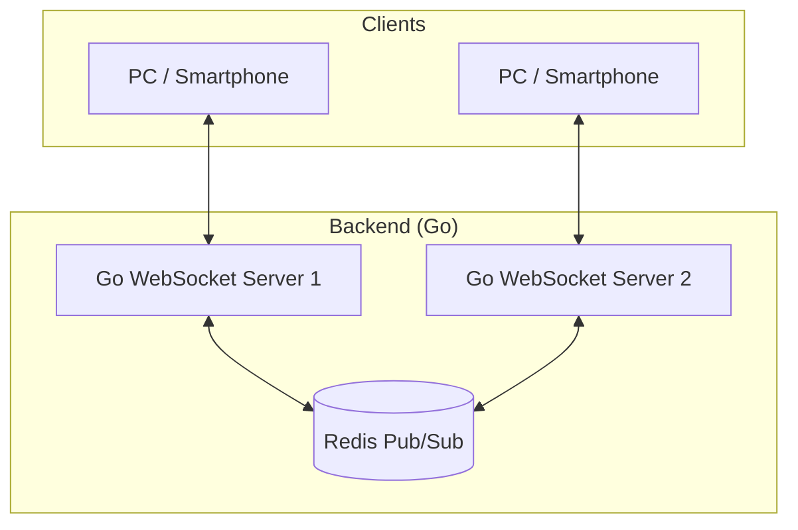

# リアルタイム共有ホワイトボード (Go & React)

[](https://opensource.org/licenses/MIT)

複数ユーザーが同時に描画を共有できるホワイトボードアプリです。
バックエンドは高性能な **Go**、フロントエンドは **React (TypeScript)** で構築されています。

---

## 🚀 主要機能

- **高速メッセージ同期**: Go (Goroutines) と WebSocket による低遅延な描画共有。
- **Redis 連携**: Redis Pub/Sub で複数サーバー間でも状態を共有できます。
- **モバイル対応**: PC のマウス操作だけでなく、スマホのタッチ操作にも対応。
- **最新技術スタック**: Vite / React / TypeScript による高速で型安全な開発。

---

## 🏗 システム構成



---

## 🛠 技術スタック

- **バックエンド**: Go (Gorilla WebSocket)
- **フロントエンド**: React (Vite), TypeScript
- **インフラ**: Docker, Redis
- **通信方式**: WebSocket

---

## 🚦 開発環境での実行方法

### 事前準備
- Docker / Docker Compose
- [Go 1.2x+](https://golang.org/dl/)

### 実行手順
1. インフラを起動
   ```bash
   docker-compose up -d
   ```
2. バックエンドを起動
   ```bash
   cd backend
   go mod download
   go run main.go
   ```
3. フロントエンドを起動
   ```bash
   cd frontend
   npm install
   npm run dev
   ```

---

## 🚀 ポートフォリオ公開方法

このプロジェクトは **GitHub Pages にフロントエンド** を公開し、**Railway にバックエンド** を配置する構成を想定しています。

### フロントエンド: GitHub Pages
1. GitHub に `kuru99/SharedWhiteboard` というリポジトリを作成します。
2. このローカルリポジトリを `main` ブランチで GitHub に push します。
3. `frontend/.env.example` を `frontend/.env` にコピーします。
4. `VITE_API_BASE_URL` と `VITE_WS_BASE_URL` に Railway で公開したバックエンド URL を設定します。
5. GitHub Pages の設定では、`gh-pages` ブランチを公開先に指定します。
6. フロントエンドをビルドします:
   ```bash
   cd frontend
   npm install
   npm run build
   ```
7. 生成された静的ファイルは `frontend/dist` に出力されます。

### バックエンド: Railway
1. Railway にログインし、New Project でこのリポジトリを接続します。
2. Railway のプロジェクトで Redis プラグインを追加するか、`REDIS_URL` を設定します。
3. 環境変数を設定します:
   - `PORT` は Railway が自動で割り当てます。
   - `REDIS_URL` または `REDIS_HOST`, `REDIS_PORT`, `REDIS_PASSWORD`。
4. `backend/main.go` は環境変数から Redis とポートを読み取るため、そのままデプロイできます。
5. デプロイ後、Railway の公開 URL をコピーします。
6. その URL を `frontend/.env` の `VITE_API_BASE_URL` と `VITE_WS_BASE_URL` に設定します。

### GitHub Actions デプロイ
`.github/workflows/deploy-frontend.yml` にワークフローを用意しています。
`main` ブランチに push すると、フロントエンドがビルドされ `frontend/dist` が `gh-pages` ブランチに公開されます。

### 補足
- GitHub Pages ではフロントエンドのみを公開し、バックエンドは Railway で公開します。
- `frontend/src/components/BoardSelector.tsx` と `frontend/src/components/Whiteboard.tsx` は `VITE_API_BASE_URL` / `VITE_WS_BASE_URL` を使用してバックエンドに接続します。
- `backend/main.go` は `PORT`、`REDIS_URL` などの環境変数に対応しています。
- GitHub Pages 公開先は `kuru99/SharedWhiteboard` を想定しています。

### 補足
- `frontend/src/components/BoardSelector.tsx` と `frontend/src/components/Whiteboard.tsx` は `VITE_API_BASE_URL` / `VITE_WS_BASE_URL` を使ってバックエンドに接続します。
- `backend/main.go` は `PORT`、`REDIS_URL` などの環境変数に対応しています。
- GitHub Pages 公開先は `kuru99/SharedWhiteboard` を想定しています。

## 👤 作者
- **kuru99**
- Interest: Backend Engineering, Distributed Systems
